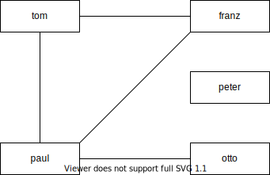

!!!! | otto
!!!!

Pruefe: otto -> paul | 0
in recursion
-> paul | 0

???? | 0
otto
????

!!!! | paul
otto
!!!!

Pruefe: paul -> otto | 1
Pruefe: paul -> franz | 1
in recursion

-> franz | 1
???? | 1
otto
paul
????

!!!! | franz
otto
paul
!!!!

Pruefe: franz -> Tom | 2

----  | 2
otto
paul
franz
Tom
\----

Pruefe: paul -> Tom | 1

----  | 1
otto
paul
franz
Tom
Tom
\----

